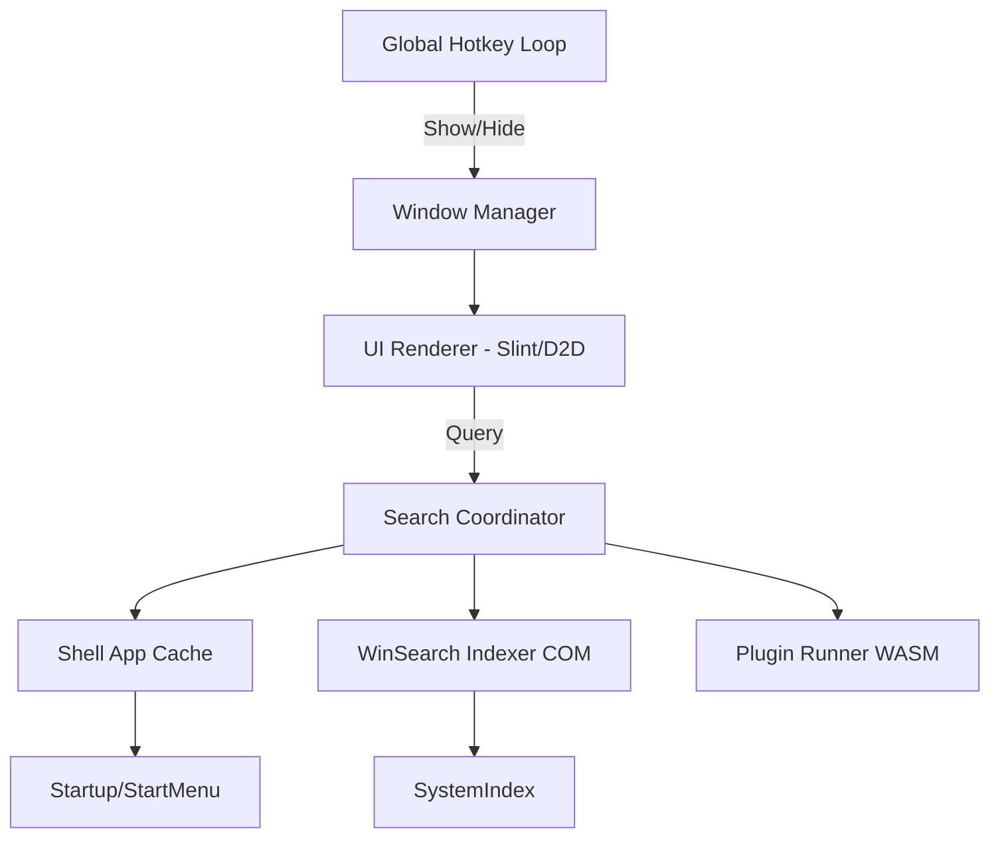

# Windows Launcher Application - Technology Stack & Development Plan - Nexus

## **Recommended Technology Stack**

### **Core Framework: Rust + `windows` (windows-rs)**
- **Why**: Microsoft's official Rust bindings. Offers type-safe access to Win32, WinRT, and COM APIs. Essential for modern Windows integration.
- **Key Crates**:
  - `windows` - Official Microsoft bindings for all Windows APIs.
  - `winit` or `native-windows-gui` - Window management.
  - `slint` - Modern, lightweight UI framework with a native backend.
  - `tray-icon` - Modern system tray integration.
  - `global-hotkey` - Cross-platform (incl. Windows-specific) hotkey handling.

**Alternative (if Rust is unfamiliar): C++/WinRT**
- Native performance, direct access to XAML Islands or Composition APIs.

### **UI Framework: Slint or Custom Direct2D**
- **Slint**: Compiled to native code, <300KB overhead, GPU accelerated, extremely low RAM (~5-10MB).
- **Direct2D + DirectWrite**: For maximum control. Use `windows` crate to draw directly to a borderless window. This is the "gold standard" for performance.
- **Visuals**: Use `Desktop Window Manager (DWM)` APIs for **Mica** or **Acrylic** effects to match Windows 11+ aesthetics.

### **Search & Indexing: Hybrid Approach**
- **Apps**: Enumerate via Shell APIs and `PackageManager` (for UWP/Store apps). Do not just scan the filesystem.
- **Files**: Query the **Windows Search Indexer** (WDS) via SQL-like queries through COM. This avoids high CPU/IO usage.
- **Speed**: Use a memory-resident `Trie` or `FST` (Finite State Transducer) for instant character-by-character filtering.

## **Development Plan**

### **Phase 1: Foundation (Week 1-2)**
```
1. Project Setup
   - Rust: `cargo new winlauncher`
   - Add dependencies: windows (with Win32_UI_WindowsAndMessaging, Win32_System_Com features), slint, global-hotkey

2. Global Hotkey System
   - Register Alt+Space using `global-hotkey` or Win32 `RegisterHotKey`
   - Handle messages in a background loop to keep UI responsive

3. Transparent Window with Mica/Acrylic
   - Create borderless `WS_POPUP` window
   - Use `DwmSetWindowAttribute` for Mica/Acrylic transparency
   - Ensure the window is "Topmost" and centered
```

### **Phase 2: Core UI & Typing (Week 3-4)**
```
1. Slint/Direct2D Interface
   - Minimalist text input
   - Dynamic result list (max 5-8 items)
   - Virtualized rendering (only draw visible items)

2. Micro-Animations
   - Smooth slide-down/fade-in entry (WinUI 3 style)
   - Hover highlights with subtle borders

3. Focus Management
   - Force focus on show
   - Block Alt/Tab from breaking the launcher state
```

### **Phase 3: Search Backends (Week 5-6)**
```
1. Intelligent App Discovery
   - Index `.lnk` files from Start Menu (Shell APIs)
   - Map UWP App IDs via `windows::Management::Deployment`
   - Cache results in a Bloom Filter or Trie for O(1) lookups

2. Windows Search Integration
   - Craft ADODB queries for the `SystemIndex`
   - Filter by "FileKind" for quick results
   - Rank results by "Rank" (Windows native scoring)

3. Scoring Algorithm
   - Frequency-based (MRU)
   - Initial character match priority
```

### **Phase 4: Advanced Features (Week 7-8)**
```
1. Quick Actions & Web
   - Inline calculator (using `eval-expr` or similar)
   - Web search shortcuts (e.g., "g search" -> open browser)

2. System Commands
   - "lock", "sleep", "restart" with confirmation

3. Plugin Architecture
   - Use `wasmer` or `wasmtime` for safe, lightweight WASM-based plugins
```

### **Phase 5: Performance & Deployment (Week 9-10)**
```
1. Memory Optimization
   - Resident Set Size (RSS) targeting <12MB
   - Use `jemalloc` or `mimalloc` for better fragmentation management

2. Startup Optimization
   - Profile with `Tracy` or `Windows Performance Analyzer`
   - Pre-calculate UI layout at compile time (Slint)

3. Zero-Config Installer
   - WiX Toolset or a simple portable Rust-based installer
```

## **Architecture Diagram**


## **Performance Targets (2025 Standard)**
- **Cold Start**: Pre-loaded in tray, <20ms toggle latency
- **Memory**: <15MB (Idle), <25MB (Searching)
- **CPU**: <0.1% on idle
- **Binary Size**: <5MB (compressed)

## **Alternative Stacks Considered**

| Stack | Memory | Startup | Aesthetics | Difficulty |
|-------|--------|---------|------------|------------|
| **Rust + Slint** | **~8MB** | **Instant** | **Premium** | **Medium** |
| Rust + Win32/D2D | ~5MB | Instant | Native | High |
| C# + WinUI 3 | ~80MB | Medium | Native | Low |
| Tauri 2.0 | ~40MB | Good | Modern | Low |

## **Recommended Tools**
- **IDE**: VS Code + `rust-analyzer`
- **Profiling**: `Tracy` (best for Rust/C++ frame profiling)
- **UI Design**: Slint Live Preview or Figma
- **Windows APIs**: `windows-rs` explorer (Microsoft Docs)
